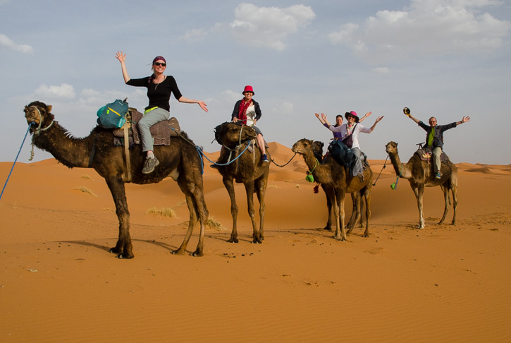

#  **Explore the Sahara!**

The dunes and plains of the Sahara strecth into the distance for an eternity, reaching from the Atlantic Coast to the Red Sea, it covers a quarter of the African continent and is the size of the United States!

---

## **What to bring... check your checklist!**

1.  A windbreaker or light jacket  
Although there is an average temperature of over 40 degrees celcius, this will be needed to survive the cooler nights

2. A headscarf or desert hats  
To block the sun and dust.

3. Hiking Boots  
For the day and night treks.

4. Comfortable jeans or trousers  
To cover your whole leg to protect from the camel's rough fur.

5. Water bottle  
We've got the water, fill up at each camel stop!

---

## **Camel rides** - The most reliable way to travel

             Hold on tight while going over the sand dunes!

---
## **When to go to the Sahara Desert**

The summer is one to avoid - Between June and September the sun is simply too hot for it to be enjoyable.  
Winter is manageable if you werap up warm; however, the  best time to visit the Sahara Desert is definitely in spring or autumn.  
By October the searing heat of the summer has passed awaybut it's still pleasant after dark. Similar temperaturesare found in spring, but between February and April, sandstorms are common.  

---

## **Glamp in the desert tents!**

             Sleep under the stars, enjoy the landscape...

  
The essential Sahara activity is to stay overnight in a tenter Berber camp. Accommodation ranges from the luxurious to the simple but comfortable to make it feel more authentic. Blankets are provided but you can bring your own sleeping bag. You will be accompanied by traditinal music and dancing.
---
## **Not yet tempted? Read Liakat's Review...**

'As sunset approached, our group climbed to the top of a sand dune which was situated behind our camp. Everything was perfect. There was virtually no sound, and I began to take the absurdity of just how far out I was, the light was perfect. We settled down for a lovely meal in the evening by the fire. Although it got quite cold by the night, there was ample bedding available, and the warmth from the fire was more than adequate to keep comftorble.' - Liakat after her Sahara holiday